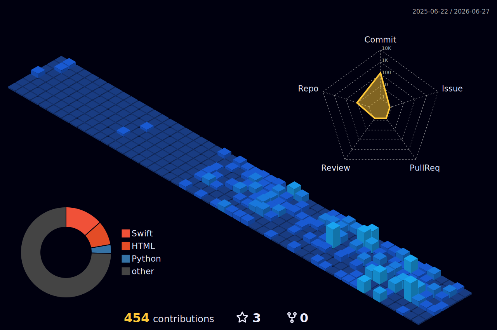

<div align="center">

<!-- Typing animation header -->
[](https://git.io/typing-svg)

</div>

---

```swift
let raaju = Developer(
    role:     "iOS Developer",
    based:    "Dhaka, Bangladesh 🇧🇩",
    company:  "Bdjobs.com Ltd",
    focus:    ["Swift", "UIKit", "SwiftUI"],
    currently: "Building user-centric iOS experiences"
)
```

---

### Stats

<div align="center">


&nbsp;&nbsp;


</div>

---

### Contributions

<div align="center">



</div>

---

### Featured

| Project | About |
|---|---|
| [Swift Playground Solutions](https://github.com/RaajuPahlowan/Swift-Playground-Solutions) | Algorithm practice & coding exercises in Swift |
| [rideSharing](https://github.com/RaajuPahlowan/rideSharing) | iOS app connecting riders at the tap of a button |
| [iOS Basic Browser](https://github.com/RaajuPahlowan/iOS-basic-web-browser) | Fast, minimal web browser for iOS |

---

<div align="center">

[](https://twitter.com/RaajuPahlowan)
&nbsp;
[](https://github.com/RaajuPahlowan)

</div>
